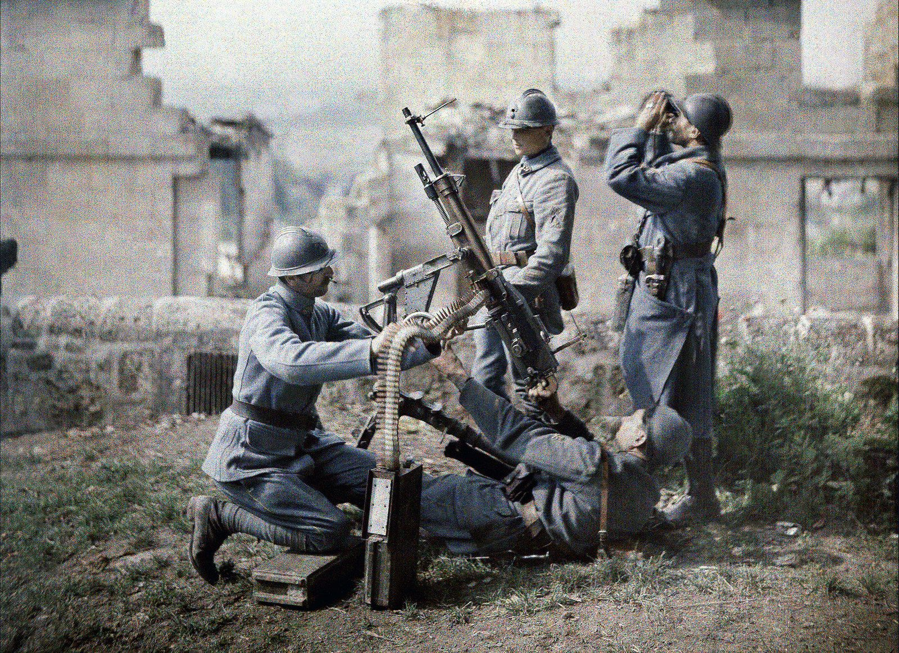
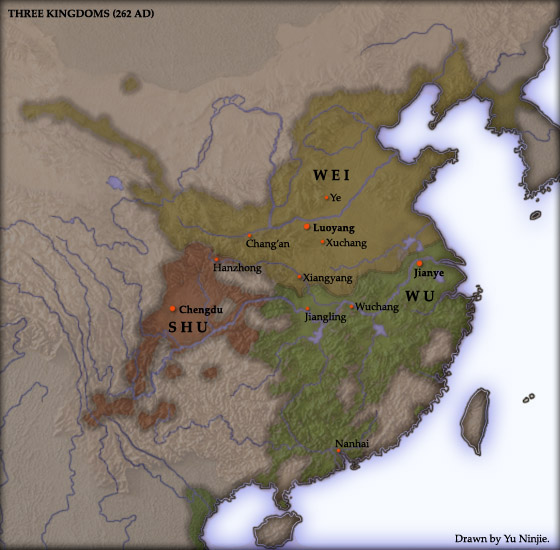
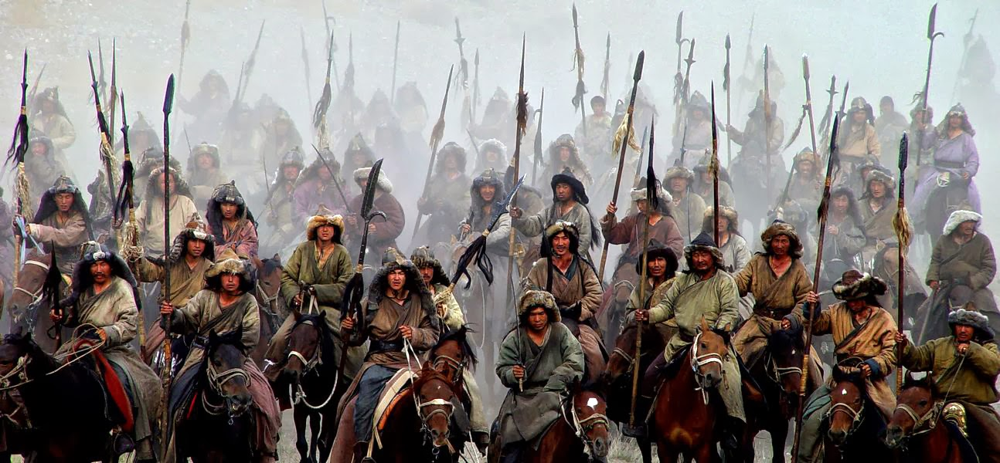
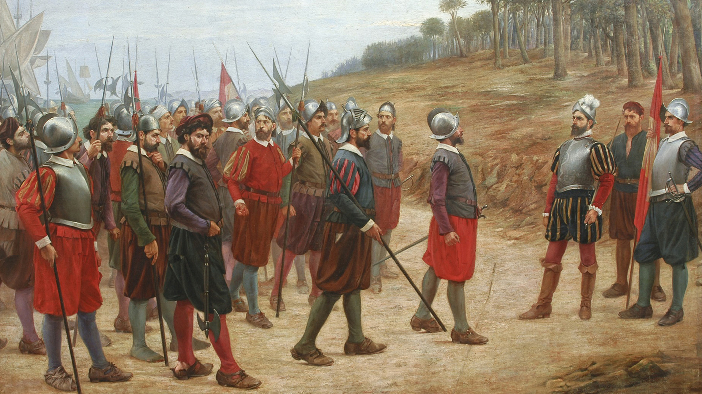

## Wstęp

Postrzeganie historii jest dzisiaj ważnym elementem międzynarodowej dyskusji. Przeszłość wzbudza emocje, zwłaszcza tam, gdzie nie brakuje zdań rozbieżnych, często zależnych od narodowej perspektywy. Dlatego tak cenne jest kształtowanie wspólnych doświadczeń, wychodzenie naprzeciw międzynarodowemu dialogowi, przełamywanie uprzedzeń. Niejednoznaczność interpretacji wydarzeń sprzyja dyskusji, zwłaszcza tej pozbawionej utartych schematów. Kontrowersje i konflikty były i będą częścią historii, co podkreśla znaczenie jej omawiania, które musi być oparte na zrozumieniu i obiektywizmie.

**Prezentacja jest ograniczona do 5 najbaradzeiej krwawych konfliktów**

Warto dodać, że oszacowana wartość zgonów jest podawana ze wzory: 
$$ \sqrt(minimalna,szacowana,ilośc,zgonów * maksymalna,szacowana,ilośc,zgonów) $$
---

## Przegląd

5 konfliktów z największa liczbą ofiar:

1. II wojna światowa (1939 do 1945)
2. Wojna domowa w chinach (wojna trzech królestw)
3. Podboje Mongołów (1237 do 1240)
4. Europejska colonizacja Ameryk
5. Rebelia tajpingów (Chiny)
---

## II wojna światowa

Największa wojna światowa w historii, trwająca od 1 września 1939 do 2 września 1945 (w Europie do 8/9 maja 1945). Jej teatr działań wojennych objął prawie całą Europę, wschodnią i południowo-wschodnią Azję, północną Afrykę, część Bliskiego Wschodu i wszystkie oceany. Niektóre epizody wojny rozgrywały się nawet w Arktyce i Ameryce Północnej. Poza większością państw europejskich i ich koloniami, brały w niej udział państwa Ameryki Północnej i Ameryki Południowej oraz Azji. Głównymi stronami konfliktu były państwa Osi i państwa koalicji antyhitlerowskiej (alianci).  

| Ilość uczestniczących ludzi        | Szacowana liczba zgonów           | Długość trwania |
| ------------- |:-------------:| -----:|
| 1,7 mld w tym (11 mln ludzi z bronią)           | około 85 mln ludzi | 6 lat |

---

## Wojna trzech królest

Za datę jej początku uznaje się najczęściej upadek dynastii Han w 220 r. Dla wielu chińskich historyków Epokę otwiera jednak już powstanie Żółtych Turbanów w 184 r. W 220 r. Cesarstwo rozpadło się na trzy oddzielne państwa: Shu Han (蜀漢, zwane także Shu, 蜀), Wei (魏) oraz Wu (吳). Ich władcy, rywalizując ze sobą o jak największe wpływy i rozszerzenie swych domen, prowadzili nieustanne wojny między sobą do 280 r.

| Ilość uczestniczących ludzi        | Szacowana liczba zgonów           | Długość trwania |
| ------------- |:-------------:| -----:|
|     -      | około 38 mln ludzi (~70% ludności Chin) | około 60 lat |

---

## Podboje Mongołów

Mongołowie były to koczownicze plemiona, które zamieszkiwały początkowo tereny Dalekiego Wschodu, a dokładnie tereny dzisiejszej Mongolii, Mandżurii oraz południowo-wschodniej Syberii - stąd ich sąsiedztwo z krajem plemion ruskich. W okresie XII wieku plemiona mongolskie przeszły przez proces bardzo znaczących przemian społecznych, które doprowadziły między innymi do całkowitego rozkładu układu rodowego. Układ ten zastąpiła forma bardziej zaawansowana, a mianowicie rodzina patriarchalna. Przetrwały jednak pewne elementy wspólnoty, choć rodzina z całą swoją hierarchią była najbardziej rozpowszechniona. Rozkład wspólnoty rodowej przyniósł ze sobą - w naturalny sposób - rozkład i rozwarstwienie członków dawnej wspólnoty rodowej.

| Ilość uczestniczących ludzi        | Szacowana liczba zgonów           | Długość trwania |
| ------------- |:-------------:| -----:|
|     -      | około 35 mln ludzi  | około 199 lat |

---

## Europejskie podboje Ameryk

Podbój prowadzili przedsiębiorczy i ambitni konkwistadorzy hiszpańscy, kierujący niewielkimi, lecz dobrze wyposażonymi i zaprawionymi w bojach oddziałami żołnierzy-awanturników, żądnych łupów i przygód. Często byli nimi przestępcy, zwalniani specjalnie z więzień na dalekie i nader ryzykowne wyprawy kolonialne. Wielu rycerzy było ogarniętych zapałem religijnym i jechało do nowo odkrytej Ameryki, by wziąć udział w nawracaniu nowych dusz na wiarę chrześcijańską. Organizacją i finansowaniem większych wypraw zajmowała się początkowo korona hiszpańska lub pełnomocnicy królewscy. Z czasem organizacją wypraw zajęli się też bogatsi szlachcice.

| Ilość uczestniczących ludzi        | Szacowana liczba zgonów           | Długość trwania |
| ------------- |:-------------:| -----:|
|     -      | około 34 mln ludzi  | około 199 lat |

---
