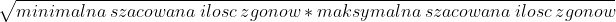
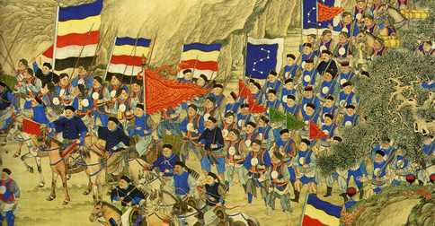

## Wstęp

Postrzeganie historii jest dzisiaj ważnym elementem międzynarodowej dyskusji. Przeszłość wzbudza emocje, zwłaszcza tam, gdzie nie brakuje zdań rozbieżnych, często zależnych od narodowej perspektywy. Dlatego tak cenne jest kształtowanie wspólnych doświadczeń, wychodzenie naprzeciw międzynarodowemu dialogowi, przełamywanie uprzedzeń. Niejednoznaczność interpretacji wydarzeń sprzyja dyskusji, zwłaszcza tej pozbawionej utartych schematów. Kontrowersje i konflikty były i będą częścią historii, co podkreśla znaczenie jej omawiania, które musi być oparte na zrozumieniu i obiektywizmie.

**Prezentacja jest ograniczona do 5 najbaradzeiej krwawych konfliktów**

Warto dodać, że oszacowana wartość zgonów jest podawana ze wzory: 

---

## Przegląd

5 konfliktów z największa liczbą ofiar:

1. II wojna światowa (1939 do 1945)
2. Wojna domowa w chinach (wojna trzech królestw)
3. Podboje Mongołów (1237 do 1240)
4. Europejska colonizacja Ameryk
5. Rebelia tajpingów (Chiny)
---

## II wojna światowa

Największa wojna światowa w historii, trwająca od 1 września 1939 do 2 września 1945 (w Europie do 8/9 maja 1945). Jej teatr działań wojennych objął prawie całą Europę, wschodnią i południowo-wschodnią Azję, północną Afrykę, część Bliskiego Wschodu i wszystkie oceany. Niektóre epizody wojny rozgrywały się nawet w Arktyce i Ameryce Północnej. Poza większością państw europejskich i ich koloniami, brały w niej udział państwa Ameryki Północnej i Ameryki Południowej oraz Azji. Głównymi stronami konfliktu były państwa Osi i państwa koalicji antyhitlerowskiej (alianci).  

| Ilość uczestniczących ludzi        | Szacowana liczba zgonów           | Długość trwania |
| ------------- |:-------------:| -----:|
| 1,7 mld w tym (11 mln ludzi z bronią)           | około 85 mln ludzi | 6 lat |

---

## Wojna trzech królest

Za datę jej początku uznaje się najczęściej upadek dynastii Han w 220 r. Dla wielu chińskich historyków Epokę otwiera jednak już powstanie Żółtych Turbanów w 184 r. W 220 r. Cesarstwo rozpadło się na trzy oddzielne państwa: Shu Han (蜀漢, zwane także Shu, 蜀), Wei (魏) oraz Wu (吳). Ich władcy, rywalizując ze sobą o jak największe wpływy i rozszerzenie swych domen, prowadzili nieustanne wojny między sobą do 280 r.

| Ilość uczestniczących ludzi        | Szacowana liczba zgonów           | Długość trwania |
| ------------- |:-------------:| -----:|
|     -      | około 38 mln ludzi (~70% ludności Chin) | około 60 lat |

---

## Podboje Mongołów

Mongołowie były to koczownicze plemiona, które zamieszkiwały początkowo tereny Dalekiego Wschodu, a dokładnie tereny dzisiejszej Mongolii, Mandżurii oraz południowo-wschodniej Syberii - stąd ich sąsiedztwo z krajem plemion ruskich. W okresie XII wieku plemiona mongolskie przeszły przez proces bardzo znaczących przemian społecznych, które doprowadziły między innymi do całkowitego rozkładu układu rodowego. Układ ten zastąpiła forma bardziej zaawansowana, a mianowicie rodzina patriarchalna. Przetrwały jednak pewne elementy wspólnoty, choć rodzina z całą swoją hierarchią była najbardziej rozpowszechniona. Rozkład wspólnoty rodowej przyniósł ze sobą - w naturalny sposób - rozkład i rozwarstwienie członków dawnej wspólnoty rodowej.

| Ilość uczestniczących ludzi        | Szacowana liczba zgonów           | Długość trwania |
| ------------- |:-------------:| -----:|
|     -      | około 35 mln ludzi  | około 199 lat |

---

## Europejskie podboje Ameryk

Podbój prowadzili przedsiębiorczy i ambitni konkwistadorzy hiszpańscy, kierujący niewielkimi, lecz dobrze wyposażonymi i zaprawionymi w bojach oddziałami żołnierzy-awanturników, żądnych łupów i przygód. Często byli nimi przestępcy, zwalniani specjalnie z więzień na dalekie i nader ryzykowne wyprawy kolonialne. Wielu rycerzy było ogarniętych zapałem religijnym i jechało do nowo odkrytej Ameryki, by wziąć udział w nawracaniu nowych dusz na wiarę chrześcijańską. Organizacją i finansowaniem większych wypraw zajmowała się początkowo korona hiszpańska lub pełnomocnicy królewscy. Z czasem organizacją wypraw zajęli się też bogatsi szlachcice.

| Ilość uczestniczących ludzi        | Szacowana liczba zgonów           | Długość trwania |
| ------------- |:-------------:| -----:|
|     -      | około 34 mln ludzi  | około 199 lat |

---

## Rebelia tajpingów
Po I wojnie opiumowej w ciągu kilku lat import tkanin bawełnianych i wełnianych z Wielkiej Brytanii do Chin wzrósł ok. 4-krotnie. Zrujnował on tysiące drobnych zakładów tkackich w całym kraju i spowodował wystąpienie dużego deficytu w handlu zagranicznym. Wzrósł też znacznie kurs srebrnego pieniądza, jakim płacono za import towarów, w stosunku do pieniędzy miedzianych, będących w obrocie wewnętrznym. W konsekwencji nastąpił znaczny wzrost podatków i gwałtowne ubożenie ludności. Na tym tle doszło do dziesiątek powstań i buntów, głównie chłopskich, zwłaszcza w prowincjach południowych, które najbardziej ucierpiały wskutek brytyjskiej ekspansji.

W połowie XIX wieku bunty te stały się zarzewiem wielkiego ruchu o charakterze religijno-militarnym, zwanego powstaniem tajpingów. Przywódcą ruchu stał się charyzmatyczny mistyk, Hong Xiuquan. Proklamował on w sierpniu 1851 roku utworzenie Niebiańskiego Królestwa Wielkiego Pokoju (chin. 太平天囯 Tàipíng Tiānguó), od którego chińskiej nazwy pochodzi nazwa powstania. Sam siebie obwołał władcą. Ogłosił też nową religię, będącą mieszanką chrześcijaństwa i konfucjanizmu. Wprowadzała ona purytańskie zasady moralne, wspólną własność majątkową, równy podział ziemi, równość kobiet i mężczyzn, mandarynów i chłopów itp. wprowadzając w społeczeństwie surową dyscyplinę i wojskową organizację. Znakiem tajpingów była żółta przepaska na głowie i długie włosy bez warkoczyka.

| Ilość uczestniczących ludzi        | Szacowana liczba zgonów           | Długość trwania |
| ------------- |:-------------:| -----:|
|     -      | około 31 mln ludzi  | około 14 lat |

---

## Podsumowanie

Wojny przyszłości nadal będą bezpośrednio lub pośrednio oddziaływać na wszystkie płaszczyzny i rodzaje stosunków międzynarodowych oraz na wszystkie podmioty w nich uczestniczące. Będą one prowadzone przy masowym użyciu
zaawansowanych technologii, w tym sprzętu bezzałogowego, środków automatyzacji dowodzenia, nowoczesnych systemów informatycznych oraz broni precyzyjnego rażenia. Największym zagrożeniem jest wzrastające prawdopodobieństwo użycia broni masowego rażenia, w tym przede wszystkim broni jądrowej.
Dlatego negatywne doświadczenia związane z prowadzeniem wojen przekonują,
że nastał czas, by wszelkie spory międzynarodowe były załatwiane przy pomocy środków pokojowych. Jest to przedsięwzięcie trudne, bowiem różnorodność i skala sytuacji
konfliktowych jest nadal bardzo duża. Ponieważ bezpieczeństwo globalne dotyczy interesu ogólnoświatowego, dlatego w rozwiązanie nowych wyzwań i zagrożeń dla pokoju
należy angażować jak najwięcej podmiotów bezpieczeństwa.
